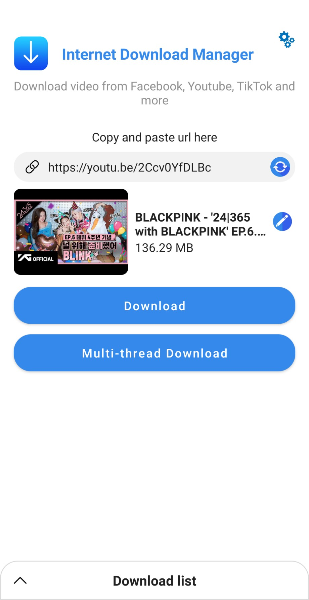

# MGT Downloader
**An app for downloading files from direct download url or from Facebook, TikTok, etc.**

## Features
* Download and manage files
* Resume, retry disrupted or failed download tasks efficiently
* Preview Zip file content at an url and allow downloading only parts of it
* Support downloading videos from Facebook, TikTok (no watermark), etc.
* Allow speeding up download tasks by downloading multiple parts concurrently
* And more

## Build and run project
### Clone project:
```
git clone https://github.com/thanductaimgt/MGTDownloader.git
```
### Update `local.properties`
MGT Downloader use some dynamic configurations from http://dontpad.com API, to be able to change them dynamically.

To build project, add these lines in the file `local.properties` in project root directory:

```
# For building a release version, replace with your own release configs
signConfigs.storeFile=/absolute/path/to/jks/file
signConfigs.storePassword=password
signConfigs.keyAlias=dontpad
signConfigs.keyPassword=password

# Base API urls to get remote configurations
# Test env
baseUrl.managementTest=http://dontpad.com/random/opensource/mgtdownloader/test/
# Live env
baseUrl.managementLive=http://dontpad.com/random/opensource/mgtdownloader/live/
```

### Use your own management space
`baseUrl.managementTest` and `baseUrl.managementLive` are base urls to get remote configs, including:
* App configs: configs for whole app, path: `app_config`
* Extractor configs: configs to extract file metadata (name, thumbnail, download url, etc.) from a html file content, used for the feature downloading videos from TikTok, Facebook, etc.
Path: `extractor_config/${extractorName}` where `extractorName` is name of the respective extractor. Currently there are 2 extractors `tiktok` and `facebook`

MGT Downloader expects the response of every management API to be in this format:
```
{
   "body": "configuration file content"
}
```
where the value of `body` is the json string respresent the configurations.

If you want to use your own API, replace `baseUrl.managementTest` and `baseUrl.managementLive` with your own API urls and make sure that your API response is in the format above.

If you want to use your own management APIs on Dontpad, you can replace `baseUrl.managementTest` and `baseUrl.managementLive` with your own Dontpad urls and put your remote configurations in there. If you don't set any remote configurations, MGT Downloader will use the default local configurations in `assets` folder. You can use them as sample templates to create your remote configurations.

## Download the app
Download on Goole Play: https://play.google.com/store/apps/details?id=com.mgt.downloader

## Screenshots
</br>

<div align="center">
   <table align="center" border="0" >
  <tr>
    <td>

       <td>
    </td>
     <td> </td>
  </table>
  </div>
  
</br>

<div align="center">
  <table align="center" border="0" >
  <tr>
    <td> </td>
     <td> </td>
     <td> </td>
  </tr>
</table>
  </div>
  
</br>

<div align="center">
  <table align="center" border="0" >
  <tr>
    <td> </td>
  </tr>
</table>
  </div>
  
</br>

## Author

**Tai Than**
* Email: thanductaimgt@gmail.com

### Acknowledgments
* Thank you [dtrung98](https://github.com/dtrung98) for this README template
* Hat tip to anyone who's code was used
* Inspiration
* etc
